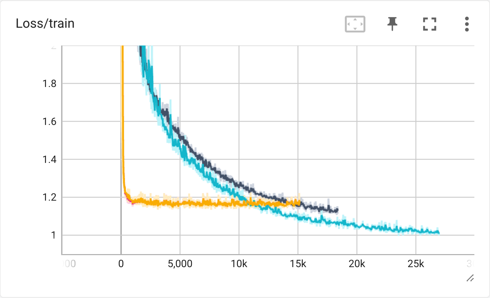
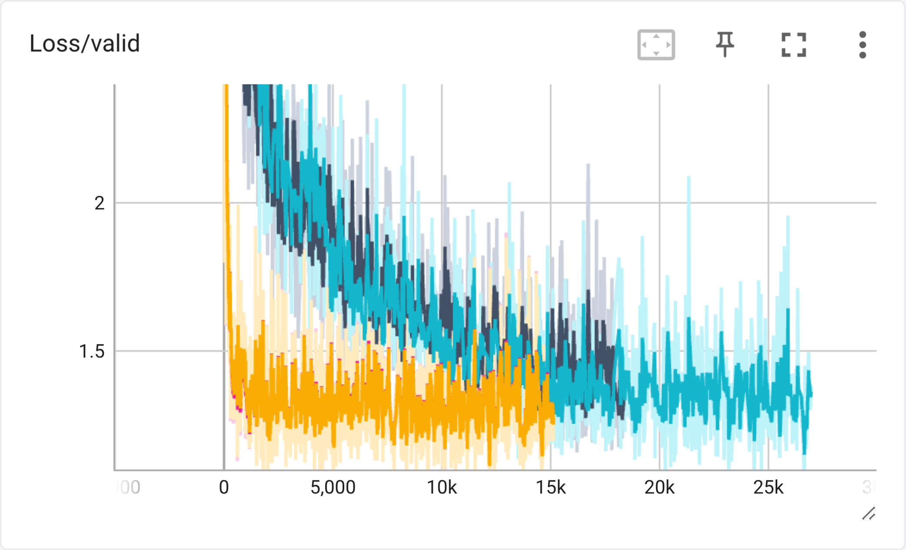

训练过程中的主要发现

（1）单纯增加神经网络层数不一定提高训练效果，会导致 Loss 很难降低

（2）单纯增加一层的大小不一定提高训练效果，从图上看 Loss 更低了，但最终提交时结果反而变差

（3）Adam optimizer 和 Adagrad optimizer 的效果均显著优于 SGD ，但观察到训练时前者虽然 Loss 下降的很快，但是最终的预测结果反而不如 Adagrad

（4）在尝试的几组参数中，Adagrad optimizer 中 learning rate 取 0.01 ，lr_decay 和 weight_decay 均取 1e-4 效果最好，具体如下

| lr_decay | weight_decay | private_score |
| :------: | :----------: | :-----------: |
|   1e-3   |     1e-3     |    2.03431    |
|   1e-4   |     1e-4     |    1.08394    |
|   1e-5   |     1e-5     |    1.23850    |
|   1e-6   |     1e-6     |    1.57222    |
|   1e-7   |     1e-7     |    1.11756    |

（5）在 train 和 valid 中 loss 更低的模型在最终预测中效果不一定比 loss 更高的好

（6）batch_size 适中时效果最好，256 的效果显著高于 128 和 512

（7）Sigmoid 和 Tanh 的下降速度均显著劣于 ReLU

（8）以下的两张图片展示了最后几次效果较好的训练图像





其中显著下降最快的两条线（lr_decay 和 weight_decay 不同）是选取了 4 个特定的 feature 之后训练的结果，虽然下降速度很快并且很快稳定，但是最终预测分数略差于取所有 117 个 feature 进行训练（1.11400 vs 1.08394）

另外两条线取全部 117 个 feature 来训练，黑色图线是

```python
self.layers = nn.Sequential(
    nn.Linear(input_dim, 64),
    nn.ReLU(),
    nn.Linear(64, 8),
    nn.ReLU(),
    nn.Linear(8, 1)
)
```

蓝色图线是

```python
self.layers = nn.Sequential(
    nn.Linear(input_dim, 64),
    nn.ReLU(),
    nn.Linear(64, 16),
    nn.ReLU(),
    nn.Linear(16, 1)
)
```

将 8 改为 16， 使得训练中的 loss 有所降低，但最终预测反而变差，猜测是层的扩大使得机器学习了噪音，使得在训练时较优，预测时反而变差